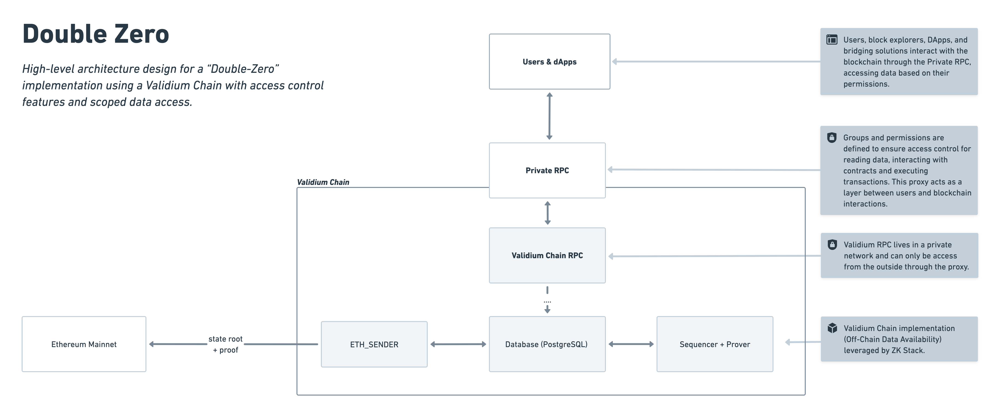

<h3 align="center"> ⛓️ 🔐 👀</h3>
<h1 align="center">Double Zero Swap</h1>

<p align="center">A private blockchain solution with access control features that leverage the ZKsync Elastic Chain ecosystem's development tools and interoperability.</p>

_High-level architecture design for a "Double-Zero" implementation using a Validium
Chain with access control features and scoped data access._

> [!NOTE]
> By combining **_Zero-Knowledge with Zero-Access_**, it offers a unique **value** proposition for organizations seeking to
> maintain **_privacy and access management_** while harnessing the benefits of EVM-compatible technologies.

## 📒 Summary

Double Zero Swap is a simple dapp built to be used on top of [Double Zero](https://github.com/Moonsong-Labs/double-zero). It resembles a constant product AMM, but with private data access and access control features, brought by the Double Zero architecture. It also allows for Escrow Trades between 2 parties via a privatized smart contract.

### Built With

- [Next.js](https://nextjs.org/)
- [Foundry ZKSync](https://foundry-book.zksync.io/)
- [Wagmi](https://wagmi.sh/)
- [Viem](https://viem.sh/)
- [RainbowKit](https://www.rainbowkit.com/)

## ⚙️ Quickstart

### 0. Prepare your environment

Clone the [Double Zero](https://github.com/Moonsong-Labs/double-zero) repository and follow the instructions to start the local network.

> [!TIP]
> This step is only required if you want to deploy the contracts using Double Zero. This app can be used with any EVM compatible chain, but you will need to change the RPC URL in the webapp config.

### 1. Deploy contracts

In the `contracts` folder, you can find the contracts to be deployed and the deploy script. Run the following command to deploy the contracts:

```bash
cd contracts

env PRIVATE_KEY="<deployer_private_key>" \
env RPC_URL="http://localhost:3050" \
env PREMIUM_USER_ADDRESS="<premium_user_address>" \
env BASIC_USER_ADDRESS="<basic_user_address>" \
contracts/scripts/deploy.sh
```

Take into account that the `RPC_URL` should be the one of the local network you have running. If attempting to run this using Double Zero, you should put the Private RPC address.

The script does several things:

- Deploys 4 ERC20 tokens
- Deploys the AMM contract
- Deploys the TradeEscrow contract
- Links everything together
- Mint some of each token and send them to the deploy address

At the end it will log the addresses of the deployed contracts:

```
DAI: <dai_address>
WBTC: <wbtc_address>
USDG: <usdg_address>
wAAPL: <waapl_address>
CPAMM: <cpamm_address>
TradeEscrow.sol: <trade_escrow_address>
```

### 2. Webapp config

The easiest way to configure the webapp is using a dotenv file:

```bash
cp web/.env.example web/.env
```

Now you can edit that file and put your data:

```
NEXT_PUBLIC_CHAIN_ID="<your_chain_id>"
NEXT_PUBLIC_CPAMM_ADDRESS="<cpamm_address>"
NEXT_PUBLIC_TRADE_ESCROW_ADDRESS="<trade_escrow_address>"
NEXT_PUBLIC_DAI_ADDRESS="<dai_address>"
NEXT_PUBLIC_WBTC_ADDRESS="<wbtc_address>"
NEXT_PUBLIC_USDG_ADDRESS="<usdg_address>"
NEXT_PUBLIC_WAAPL_ADDRESS="<waapl_address>"
NEXT_PUBLIC_CHAIN_NAME="Local Chain"
NEXT_PUBLIC_BLOCK_EXPLORER_URL="<double_zero_explorer_url>"
```

### 3. Install dependencies and run

In the `web` folder, run the following command to install the dependencies and start the app:

```bash
pnpm install
pnpm dev
```

## 🎯 **Conclusion**

Double Zero Swap demonstrates the practical application of **_private DeFi_** through:

1. **Private AMM**: A constant product market maker that maintains transaction privacy while enabling efficient token swaps.
2. **Private Escrow Trades**: A platform for 2 parties to trade assets via an Escrow smart contract without revealing balance/transaction information about the other party.
3. **Access Control**: Leverages Double Zero's architecture to manage who can view and interact with the protocol.
4. **User Experience**: Simple interface built with modern web3 tools for seamless interaction.
5. **Composability**: Built on Double Zero's infrastructure, showing how private DeFi protocols can be constructed.

By implementing a basic DeFi primitive with privacy features, Double Zero Swap serves as a blueprint for building confidential decentralized applications that maintain the benefits of public blockchain technology while protecting sensitive transaction data.
